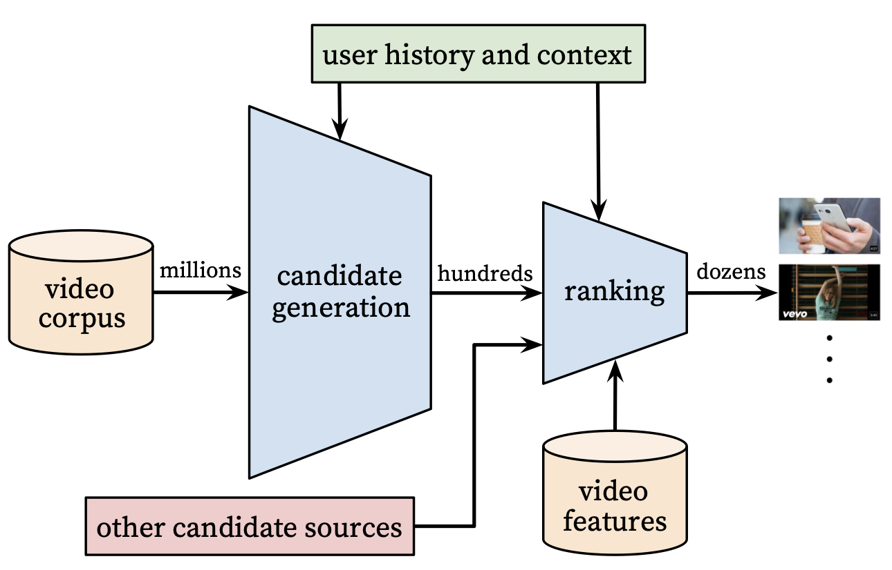

layout: post
title:  "Understandiing of Deep Neural Networks for YouTube Recommendations"
published: true
date: 2022-09-10 10:30:13 -0400
categories: default
tags: [Deep Neural Networks, Recommendation]

# dd
deep candidate generation model and then a separate deep ranking model.
Youtube recommendations have to deal with scalalibity, freshness and noises of user feedbacks.

# 

